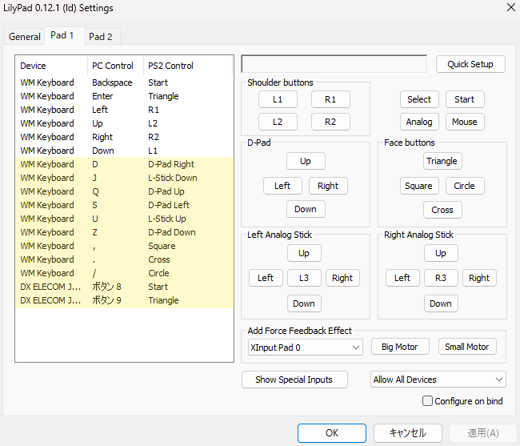
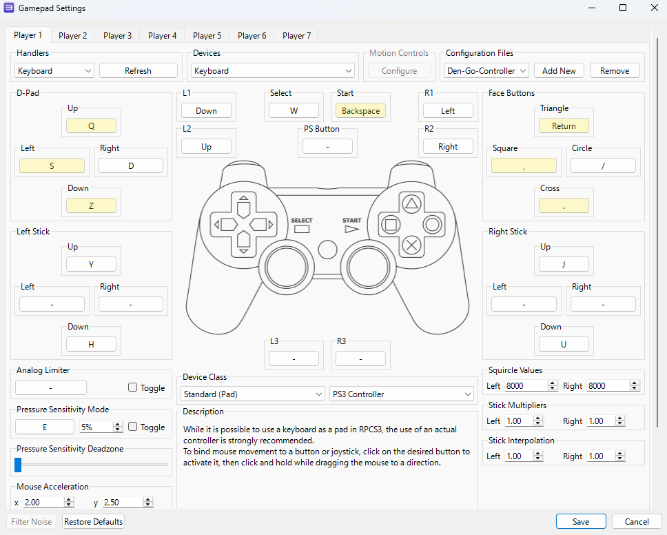

# DenGo-Controller-Converter

「電車でGO! コントローラー (SLPH-00501)」を、USB変換アダプタ「ELECOM JC-PS201USV」経由でPCに接続し、各種鉄道シミュレータ（JRETS、BVE、PCSX2、RPCS3等）で運転を楽しむためのコンバーターです。

## 主な特徴

* **マルチシミュレータ対応 (New!)**  
    JRETSに加え、BVE Trainsim、PCSX2 (PS2エミュレータ)、RPCS3 (PS3エミュレータ) 向けの専用変換ロジックを搭載。  
    UIから対象のゲームをシームレスに切り替えることができます。
* **車両特化型の特殊ロジック (New!)**  
    UIの「各特殊モード」を有効にすることで、ゲーム内の特定の車両に合わせたマニアックな操作を再現します。
    * **定速モード**: 京成AE100形 (PCSX2) や京阪8000系 (RPCS3) における、「P5時に十字ボタンの↓キーを押し続けて定速制御を行う」挙動を再現。
    * **操作反転モード**: TS御堂筋線のブレーキを強めたり弱めたりする操作ボタンの反転出力に対応。
    * **787系モード**: PS2のTSでは唯一、非常ブレーキに1発で入るボタンが存在しないため、特殊モードとして追加。  
    ※挙動は、RPCS3モードの2ハンドル(マスコン5段、7段)に設定した時と全く同じです。
* **高精度な入力制御と同期ロジック (New!)**  
    * **リリース・ガード機能**: エミュレータ特有の「キー入力のオーバーラップ(離した判定が伝わる前の次の入力による段数ズレ）」を防ぐため、キー解放時に極小の待機時間(50ms)を挟む独自設計を導入し、素早いハンドル操作でも段数がズレない安定性を実現しました。
    * **ノイズ除去フィルタ**: コントローラー特有の接点チャタリングや、移動中の一瞬の信号飛びをカットします。
* **直感的なGUI**  
    Pygameによる視覚的なインターフェース。起動したまま、対象ゲームの変更、特殊モードのON/OFF、最大ノッチ数・ブレーキ段数の調整がマウス操作で完結します。

## システムアーキテクチャ

本プログラムは、保守性と新しいゲームへの拡張性を高めるため、機能ごとにモジュールを分離した設計を採用しています。

* **UI層** (`main.py`, `ui.py`): Pygameを用いた軽量なグラフィック描画と、ユーザー設定の管理。
* **入力読み取り層** (`inputs.py`): コントローラーからの生のアナログ軸データの取得とノイズフィルタリング。
* **変換ロジック層** (`modes/` ディレクトリ): 入力された物理段数を、各ゲームの仕様に合わせたキーボード操作に変換するコア部分。オブジェクト指向を活用し、ベースロジック (`base.py`) を継承してシミュレータごとのクラス (`jrets.py`, `pcsx2.py`, `rpcs3.py`, `bve.py`) を実装しています。
* **出力層** (`pydirectinput`): エミュレータ等の低レイヤー処理にも対応可能な仮想キーボード入力の送信。

## 使い方

### 実行ファイル (exe版) を使用する場合
Pythonの環境構築は不要です。
1. GitHubの「Releases」ページから最新の `DenGoControllerConverter.exe` をダウンロードします。
2. PCにコントローラーを接続します。
3. ダウンロードしたexeファイルをダブルクリックして起動します。
4. GUI画面で対象のゲームと段数を設定し、ゲーム本体を起動してプレイしてください。

### ソースコードから実行する場合
開発やカスタマイズを行いたい方向けです。

1. **必要要件のインストール**
    ```bash
    pip install -r requirements.txt
    ```
2. **スクリプトの実行**
    PCにコントローラーを接続し、プロジェクトのルートディレクトリで以下を実行します。
    ```bash
    python main.py
    ```

> [!NOTE]
> **※用語に関する注釈**  
> 本ツールではモードの区分として「電気指令式」「自動空気ブレーキ」という呼称を用いていますが、これらは**ゲーム内での挙動（応答性重視か、込め・重なり操作重視か）を区別するための便宜的な呼称**です。  
> 実車のブレーキシステムの厳密な定義や分類（電磁直通、電磁自動など）に準拠したものではありません。

> [!WARNING]
> **重要な仕様：勾配起動について**  
> 本ツールは入力の安定性を最優先するため、「ブレーキが入っている状態では、マスコン出力は強制的に『切 (N)』になる」仕様としています。  
> そのため、ブレーキを掛けたままノッチを入れて発進する「勾配起動」操作はできない仕様です。  
> ブレーキを完全に解除した瞬間に、コントローラ側で設定したノッチが一気に入ります。

## キーアサインとエミュレータ設定

本ツールは、ゲーム（PC）に対して仮想的なキーボード入力を送信します。

### 1. JRETS / BVE Trainsim の場合
PCゲームである JRETS や BVE では、ゲーム内のキー設定がデフォルトのままであれば、ツールを起動するだけでそのまま動作します。

| コントローラ操作 | PCに送信されるキー | ゲーム内での動作 |
| :--- | :---: | :--- |
| マスコン奥 / 手前 | `Z` / `A` | ノッチを進める / 戻す |
| 切 (N) に戻す | `S` | 一発でN(ノッチオフ) |
| ブレーキ操作 | `.` / `,` / `M` | ブレーキを強める / 弱める / 一発でN(緩解) |
| 非常ブレーキ | `/` | 一発でEB(非常ブレーキ) |
| SELECT / START | `Enter` / `Backspace`| 電笛 / 空笛 |

---

※185系、キハ54系のハンドル操作は「リアル」を選択し、「自動空気ブレーキモード」で運転してください。   
※電気指令式モードの場合は、1ハンドル・2ハンドルの区別はありません。  
※適切なマスコン段数とブレーキ段数を設定してください。


### 2. PCSX2 / RPCS3 (エミュレータ) の場合 【PCSX2・RPCS3で遊ぶ場合のみ設定必須】
JRETSおよびBVEでのみ使用する場合は無視して構いません。  

本ツールはPCのキーボード入力をエミュレータに送信することで動作します。
そのため、**各エミュレータ（PCSX2 / RPCS3）で使うためには、コントローラー（Pad）設定画面で、本ツールが送信するキーを仮想コントローラーのボタンに割り当てる必要があります。**

ご自身の環境に合わせて、以下の画像を参考にキーボードの各キーをエミュレータのボタンにマッピングしてください。  
**※PCSX2に限り、STARTボタンのみ電車でGOのマスコン側のボタンを押して割り当ててください**

#### 【設定必須】 コンバーターが自動制御するキー(PCSX2、RPCS3共通)(※下画像黄色部分)
これらはマスコンやブレーキと連動しているため、表の通りに割り当てないと正常に動作しません。  
下にPadの設定画面のスクリーンショットを掲載しているので、参考にしてください。

| 送信されるキー | 割り当てるPSボタン | 動作概要 |
| :---: | :--- | :--- |
| `Q` | D-Pad Up(十字上) | ノッチを上げる / ブレーキを強める(1ハンドルモード時) |
| `Z` | D-Pad Down(十字下) | ノッチを下げる / マブレーキを弱める(1ハンドルモード時) |
| `S` | D-Pad Left(十字左) | 一発でN(ノッチオフ) |
| `.` | Cross(✕) | ブレーキを強める(2ハンドルモード時)(御堂筋線モードでは反転し、","を送信) |
| `,` | Square(☐) | ブレーキを弱める(2ハンドルモード時)(御堂筋線モードでは反転し、"."を送信) |
| `/` | Circle(◯) | 一発でEB(非常ブレーキ)(PCSX2モードのみ)(※787系モードを除く) |
| `SELECT` | Triangle(△)半押し(※例外あり) | 通常警笛(※RPCS3では京阪8000系を除いてTriangle(△)全押し) |
| `START` | START | START |

---

#### 【任意】 キーボードで直接操作するキー
電車でGO!コントローラにはボタン数が少ないため、ゲーム内のメニュー操作、視点変更、ワイパー操作などは**PCのキーボードを直接叩いて行います**。  
ご自身の都合の良いキーを割り当てて構いませんが、迷った場合は以下の設定例（添付画像参照）を推奨します。

| 推奨PCキー | 割り当てるPSボタン | ゲーム内での主な用途 |
| :---: | :--- | :--- |
| `D` | D-Pad Right (十字右) | メニューの選択など |
| `W` | Select | ワイパー動作(RPCS3モード時) |
| `Y` / `H` | L-Stick Up / Down | 視点変更など(Uで運転台を拡大/Jで運転台を縮小)(RPCS3モード時) |
| `U` / `J` | R-Stick Up / Down | 視点変更など(Uで運転台の位置を上げる/Jで運転台の位置を下げる) |
| `Enter` | Triangle(△)全押し | 非常警笛 |
| `矢印キー↓` | L1 | L1 |
| `矢印キー↑` | L2 | L2 |
| `矢印キー←` | R1 | R1 |
| `矢印キー→` | R2 | R2 |

---

【注意事項】  
・PCSX2、RPCS3共通  
※運転する車両に応じて1ハンドル・2ハンドルモードを切り替え、適切なマスコン段数とブレーキ段数を設定してください。  

・PCSX2  
※TS京成・都営浅草・京急線のAE100形を運転する場合は、ブレーキ段数を5段に設定した時に出現する通常⇆定速ボタンを押して、AE100形モードに切り替えて運転してください。   
※TS京成・都営浅草・京急線の初代AE形の運転には対応していません。    
※TS御堂筋線をプレイする場合は、ブレーキ段数を6段に設定した時に出現する通常⇆反転ボタンを押して、御堂筋線モードに切り替えて運転してください。  
※TS九州新幹線の787系をプレイする場合は、ブレーキ段数を7段に設定した時に出現する通常⇆特殊ボタンを押して、787系モードに切り替えて運転してください。  
※TS九州新幹線の800系つばめの運転には対応していません。

・RPCS3  
※Railfanの京阪8000系をプレイする場合は、ブレーキ段数を8段に設定した時に出現する通常⇆特殊ボタンを押して、京阪8000系モードに切り替えて運転してください。  

## エミュレータ側のコントローラー設定 【PCSX2・RPCS3で遊ぶ場合のみ設定必須】

### PCSX2 の設定例 (LilyPad 等)
  
※黄色で塗られているものは設定必須
※STARTボタンのみコントローラ側のボタンを押して割り当てること

### RPCS3 の設定例

※黄色で塗られているものは設定必須

> [!IMPORTANT]
> **RPCS3の京阪8000系モードについて**  
> `Pressure Sensitivity Mode` のキーに **`E`** を割り当ててください。  
> SELECTボタンを押した際には普通の警笛、Enterキーを押した場合に非常警笛を吹笛します。

## 免責事項 / Disclaimer

* 本ソフトウェアは有志による非公式のツールであり、株式会社タイトー、株式会社音楽館、および各鉄道会社様、エレコム株式会社様とは一切関係ありません。
* 本ツールを使用したことによるハードウェアの故障、データの破損、ソフトウェア側でのペナルティ、その他いかなる損害についても、開発者は一切の責任を負いません。自己責任でご使用ください。
* **無改造での二次配布禁止**
本リポジトリのリリースに含まれるバイナリ（exeファイル）を、一切の改変を加えずにそのまま他所で再配布・転載することは禁止します。
本ソースコードを元に、新しい機能（対応ゲームの追加、UIの刷新など）を付加したものを公開・配布することは大歓迎です。その際は、本リポジトリへのリンクを記載していただけると幸いです。

---

**Author:** Coruge-to